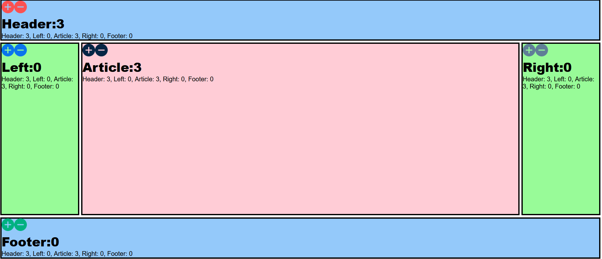

 # Holy Grail Application 

 This is a project created for the Full Stack Development course with the purpose of understanding the ideal web page layout. We were able to build a simple full stack application with a Redis database.

## Description

Simple simple full stack application.

## Technologies Used

* _HTML_
* _JavaScript_
* _CSS_

## Installation

* Clone this repository to your local machine.
* Open you command line with the path to the directory to this repository.
* Use Docker to run a new container.
* Run npm install http-server and access the page on your browser.

## Contributions 

Pull requests are welcome. For major changes, please open an issue first to discuss what you would like to change.

## License

[MIT](./LICENSE)